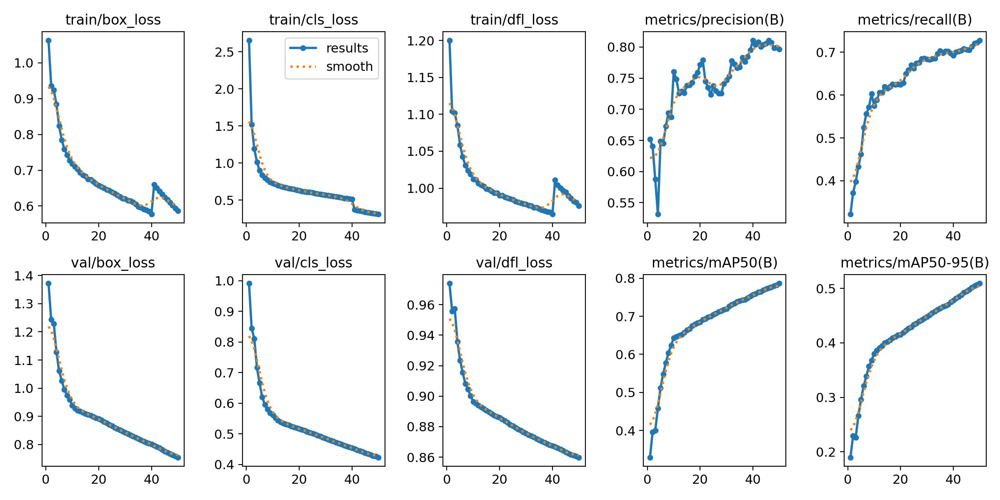
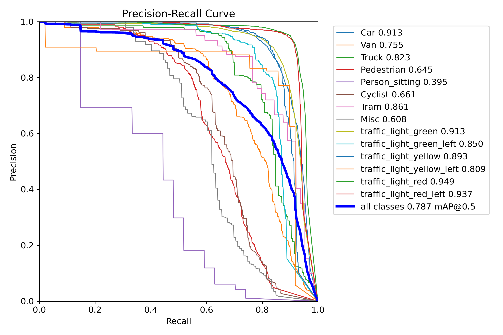

# Real-Time Object Detection for Autonomous Vehicles

A YOLOv8-based perception system that detects vehicles, traffic signs, and traffic lights in real time, built as part of the **Digital Egypt Pioneers Initiative**. The model is deployed through an interactive Streamlit dashboard that supports both offline video analysis and live webcam detection, with automatic report generation (class counts, FPS, lighting conditions, and insights).

## Project Overview

Autonomous vehicles need to perceive their surroundings quickly and reliably before they can make safe driving decisions. This project builds an end-to-end object detection pipeline — from dataset engineering to model training to deployment — that identifies three categories of road objects relevant to driving safety:

- **Vehicles** (cars, trucks, buses, etc.)
- **Traffic signs** (stop, yield, speed limits, warnings, etc.)
- **Traffic lights** (red, yellow, green, and variants)

Rather than training on a single dataset, three public benchmarks were merged into one unified detection dataset so the model learns to recognize all three object categories simultaneously, under a single YOLO label schema.

## Key Features

- **Multi-Dataset Fusion Pipeline:** Merges KITTI (vehicles), GTSRB (traffic signs), and LISA (traffic lights) into one YOLO-format dataset with a unified class map.
- **Custom Format Conversion:** Dedicated preprocessing scripts convert LISA's annotation format into YOLO bounding-box labels, with train/val/test splitting handled per source dataset before merging.
- **57-Class Detector:** A single YOLOv8s model trained to recognize 8 vehicle classes, 43 traffic sign classes, and 6 traffic light classes.
- **Interactive Streamlit Dashboard:** Two operating modes — upload-and-analyze for recorded video, and a start/stop live camera mode — both ending in an auto-generated detection report.
- **Environment-Aware Reporting:** Frame-by-frame brightness analysis flags low-light conditions, one of the key perception challenges called out in the project brief.
- **ONNX Export Path:** The trained checkpoint can be exported to ONNX for cross-platform, hardware-accelerated inference outside of the training environment.

## Project Structure

```bash
├── predictions/                                                    # Sample inference outputs
├── ultimate_overnight/                                             # Training run artifacts (checkpoints, results.csv, logs)
├── Full Project (Merging datasets, Training and Testing).ipynb     # Dataset merging, training & testing
├── Teset.py                                                        # Streamlit app: video upload + live camera detection
├── best.pt                                                         # Trained YOLOv8 model weights
├── Running example.mp4                                             # Demo of the dashboard in action
├── Project-Final-Documentation.pdf                                 # Full technical documentation
└── README.md                                                       # Project documentation
```

## Dataset

The training set was assembled from three public autonomous-driving datasets, each converted to YOLO format and merged into a single label space:

| Source Dataset | Contributes | Classes |
|---|---|---|
| **KITTI** | Vehicles | 8 |
| **GTSRB** | Traffic Signs | 43 |
| **LISA** | Traffic Lights | 6 |
| **Total** | — | **57** |

**Pipeline steps:**

1. **Structure analysis** — inspect each raw dataset's folder layout and label format before conversion.
2. **Format conversion** — convert LISA's native annotation format into YOLO `.txt` labels (image-relative bounding boxes), remapping each dataset's classes into a shared 0–56 ID space.
3. **Splitting** — stratified train/val/test splits generated per source dataset before merging, to keep class balance consistent across the combined set.
4. **Merge** — all three converted datasets are combined into one YOLO directory structure (`images/`, `labels/`, `data.yaml`) ready for training.

## Model & Training

- **Architecture:** YOLOv8s (Ultralytics)
- **Epochs:** 50
- **Batch size:** 32
- **Learning rate schedule:** Cosine annealing (0.0033326 → 0.000496)
- **Hardware:** Single RTX 4060 Laptop GPU (8GB VRAM)

### Training Results

| Epoch | Box Loss | Cls Loss | mAP50 | Precision | Recall |
|---|---|---|---|---|---|
| 1 | 1.0633 | 2.6568 | 0.329 | 0.652 | 0.322 |
| 10 | 0.7182 | 0.7281 | 0.643 | 0.760 | 0.575 |
| 20 | 0.6574 | 0.6301 | 0.685 | 0.772 | 0.625 |
| 30 | 0.6206 | 0.5697 | 0.720 | 0.747 | 0.684 |
| 40 | 0.5769 | 0.5112 | 0.757 | 0.811 | 0.693 |
| **50** | **0.5870** | **0.3098** | **0.787** | **0.797** | **0.728** |

**Final metrics (epoch 50):** mAP50-95 = **0.509**, Val Box Loss = 0.755, Val Cls Loss = 0.423.

Classification loss drops sharply across training while box loss continues improving more gradually, and validation loss stays stable relative to training loss — indicating the model generalizes without significant overfitting despite the difficulty of the merged 57-class label space.



## Streamlit Dashboard

The trained weights are served through a Streamlit app (`Teset.py`) with two modes, selectable from the sidebar:

**📹 Upload Video**
- Upload an `.mp4` / `.avi` / `.mov` file
- Frame-by-frame inference with live bounding-box overlay as the video plays
- On completion, generates a report with total/processed frame counts, average FPS, low-light flag, per-class detection counts (table + bar chart), and a "most detected object" insight

**📷 Live Camera Detection**
- Start/stop controls to run inference directly on a connected webcam feed
- Same real-time overlay and end-of-session report as the video mode, plus an FPS-based performance verdict (flags when average FPS drops below 12, suggesting a lighter model variant such as YOLOv8n)

Both modes use consistent color-coded bounding boxes per class and a shared confidence/IoU threshold (0.25 / 0.45 by default).

### Running the App Locally

```bash
git clone https://github.com/mohamed456423/Real-Time-Object-Detection-for-Autonomous-Vehicles.git
cd Real-Time-Object-Detection-for-Autonomous-Vehicles
pip install streamlit opencv-python numpy pandas ultralytics
streamlit run Teset.py
```

Make sure `best.pt` sits in the same directory as `Teset.py`, or update the `YOLO("best.pt")` path in the script.

> See `Running example.mp4` in the repo for a recorded walkthrough of the dashboard in action.

## Deployment Notes

- **Inference format:** Native PyTorch (`best.pt`) for local/Streamlit use; ONNX export supported for portable, hardware-accelerated deployment (CUDA / TensorRT, INT8 quantization for edge devices).
- **No PII processed:** the app only performs object detection on frames; no personal data is stored or transmitted.
- **Retraining:** designed to be re-run against new merged data as additional labeled sources become available, comparing new runs against the epoch-50 baseline (mAP50 = 0.787) before promoting a new checkpoint.

## Team

This project was built by a 7-person team as part of the Digital Egypt Pioneers Initiative:

| Team Member | Role | Focus |
|---|---|---|
| **Mohamed Gamal** | Project Manager | Oversight, coordination, stakeholder communication, milestone tracking |
| **Youssef Ibrahim** | Lead ML Developer | Model development, training strategy, validation oversight |
| **Youssef Mohamed** | ML Developer (Optimization) | Performance optimization, inference tuning, testing |
| **Youssef Ahmed** | Infrastructure Lead | Infrastructure management, deployment, monitoring |
| **Ahmed Mohamed** | Software Developer | System integration, Streamlit application development |
| **Ahmed Sami** | Data Specialist | Data collection, preprocessing, dataset management, QA |
| **Ali Abdelaziz** | QA & Documentation | Testing coordination, documentation |

## Results

| Metric | Score | Remarks |
|---|---|---|
| **mAP50** | 0.787 | **Exceeds Target** (0.75 acceptance threshold) |
| **mAP50-95** | 0.509 | **Solid Localization** across IoU thresholds |
| **Precision** | 0.797 | **Low False-Positive Rate** on the 57-class label space |
| **Recall** | 0.728 | **Strong Detection Coverage** across vehicles, signs, and lights |
| **Val Box Loss** | 0.755 | **Stable Generalization** — no significant overfitting vs. training loss |



## Future Work

- Production-grade REST API deployment alongside the Streamlit interface
- Automated retraining pipeline triggered by new labeled data
- Model distillation / lighter backbones (e.g., YOLOv8n) for higher FPS on edge hardware
- Expanded lighting and weather augmentation to further close the box-loss gap between training and validation

## Contact

Mohamed Gamal — [mohamedgr148@gmail.com](mailto:mohamedgr148@gmail.com)
